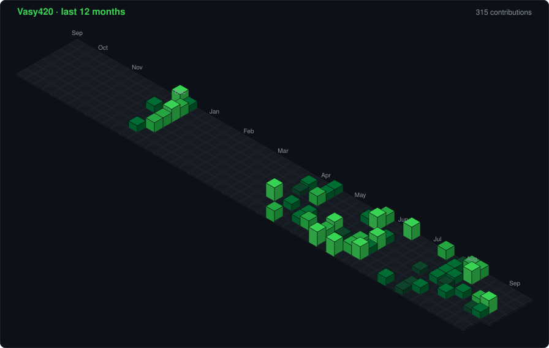
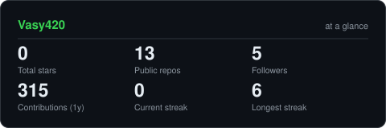
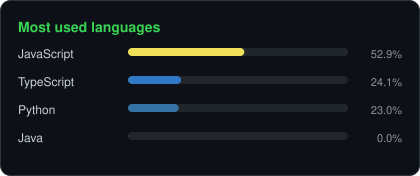
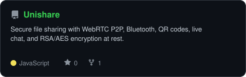
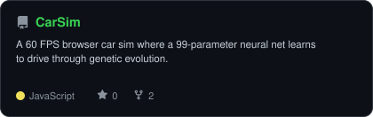
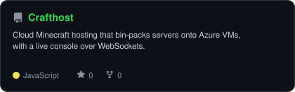
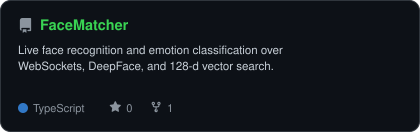

<div align="center">

<!-- Generated from the public GitHub avatar (not a personal photo). -->


<br>

<!-- NAME / TAGLINE - animated typing -->
<a href="https://github.com/Vasy420">
  
</a>

<br>

<!-- SOCIALS -->
<a href="https://linkedin.com/in/vashishta-siluveru-970507298"></a>
<a href="mailto:s.vashishta.123@gmail.com"></a>
<a href="https://vasy.co.in"></a>
<a href="https://github.com/Vasy420"></a>


</div>

---

## `~/` whoami

```console
$ cat about.txt
```

Hi, I'm **Siluveru Vashishta**. I build full-stack products that sit somewhere between
the web and machine learning, and I ship them when neither of those is cooperating.

- Currently building **[UniShare](https://github.com/Vasy420/Unishare)** and **[MediAssit](https://github.com/Vasy420/MediAssit)**
- Portfolio: **[vasy.co.in](https://vasy.co.in)**
- Learning **cloud, computer vision, and systems design**
- Fun fact: **I started coding seriously because I wanted to build things I wished existed.**

<br>

<div align="center">

## `~/` toolbox


</div>

---

<div align="center">

## `~/` skill radar

<table>
<tr>
<td width="50%" align="center" valign="middle">

<!-- Self-rated radar - edit assets/skills.json, the workflow redraws it -->
<picture>
  <source media="(prefers-color-scheme: dark)"  srcset="assets/radar-dark.svg">
  <source media="(prefers-color-scheme: light)" srcset="assets/radar-light.svg">
  
</picture>

</td>
<td width="50%" align="center" valign="middle">

<!-- Live radar built from real language byte counts across your repos -->
<picture>
  <source media="(prefers-color-scheme: dark)"  srcset="assets/radar-langs-dark.svg">
  <source media="(prefers-color-scheme: light)" srcset="assets/radar-langs-light.svg">
  
</picture>

</td>
</tr>
</table>

</div>

---

<div align="center">

## `~/` contribution calendar

<!-- 3D isometric calendar, regenerated every 6h by .github/workflows/metrics.yml -->


<br><br>

<!-- Snake eats the contribution graph - .github/workflows/snake.yml
     width 90% (not 100%) so the animation stays inside the profile column. -->
<picture>
  <source media="(prefers-color-scheme: dark)"  srcset="https://raw.githubusercontent.com/Vasy420/Vasy420/output/snake-dark.svg">
  <source media="(prefers-color-scheme: light)" srcset="https://raw.githubusercontent.com/Vasy420/Vasy420/output/snake.svg">
  
</picture>

</div>

---

<div align="center">

## `~/` the numbers

<!-- Generated by scripts/cards.py into this repo. Deliberately NOT
     github-readme-stats / streak-stats / github-profile-trophy: those are
     shared public instances that go down and take the whole section with them. -->
<picture>
  <source media="(prefers-color-scheme: dark)"  srcset="assets/card-stats-dark.svg">
  <source media="(prefers-color-scheme: light)" srcset="assets/card-stats-light.svg">
  
</picture>

<br>



</div>

---

<div align="center">

## `~/` selected work

<!-- Cards generated by scripts/cards.py from assets/projects.json.
     Stars, forks and language are pulled live from the API on every run. -->
<table>
<tr>
<td width="50%">
  <a href="https://github.com/Vasy420/Unishare">
    <picture>
      <source media="(prefers-color-scheme: dark)"  srcset="assets/card-Unishare-dark.svg">
      <source media="(prefers-color-scheme: light)" srcset="assets/card-Unishare-light.svg">
      
    </picture>
  </a>
</td>
<td width="50%">
  <a href="https://github.com/Vasy420/CarSim">
    <picture>
      <source media="(prefers-color-scheme: dark)"  srcset="assets/card-CarSim-dark.svg">
      <source media="(prefers-color-scheme: light)" srcset="assets/card-CarSim-light.svg">
      
    </picture>
  </a>
</td>
</tr>
<tr>
<td width="50%">
  <a href="https://github.com/Vasy420/Crafthost">
    <picture>
      <source media="(prefers-color-scheme: dark)"  srcset="assets/card-Crafthost-dark.svg">
      <source media="(prefers-color-scheme: light)" srcset="assets/card-Crafthost-light.svg">
      
    </picture>
  </a>
</td>
<td width="50%">
  <a href="https://github.com/Vasy420/FaceMatcher">
    <picture>
      <source media="(prefers-color-scheme: dark)"  srcset="assets/card-FaceMatcher-dark.svg">
      <source media="(prefers-color-scheme: light)" srcset="assets/card-FaceMatcher-light.svg">
      
    </picture>
  </a>
</td>
</tr>
</table>

<sub>

| project | live | stack |
|---|---|---|
| **[Unishare](https://github.com/Vasy420/Unishare)** | [unishare.vasy.co.in](https://unishare.vasy.co.in) | `React` `FastAPI` `MongoDB` `WebRTC` |
| **[CarSim](https://github.com/Vasy420/CarSim)** | [carsim.vasy.co.in](https://carsim.vasy.co.in) | `React` `Neural Nets` `Genetic Algorithms` |
| **[Crafthost](https://github.com/Vasy420/Crafthost)** | [crafthost.vasy.co.in](https://crafthost.vasy.co.in) | `Node.js` `Docker` `Azure` `Redis` |
| **[FaceMatcher](https://github.com/Vasy420/FaceMatcher)** | [github](https://github.com/Vasy420/FaceMatcher) | `FastAPI` `OpenCV` `DeepFace` `TypeScript` |

</sub>

</div>

---

<div align="center">

<sub>`01110100 01101000 01100001 01101110 01101011 01110011 00100000 01100110 01101111 01110010 00100000 01110011 01100011 01110010 01101111 01101100 01101100 01101001 01101110 01100111`</sub>

</div>
